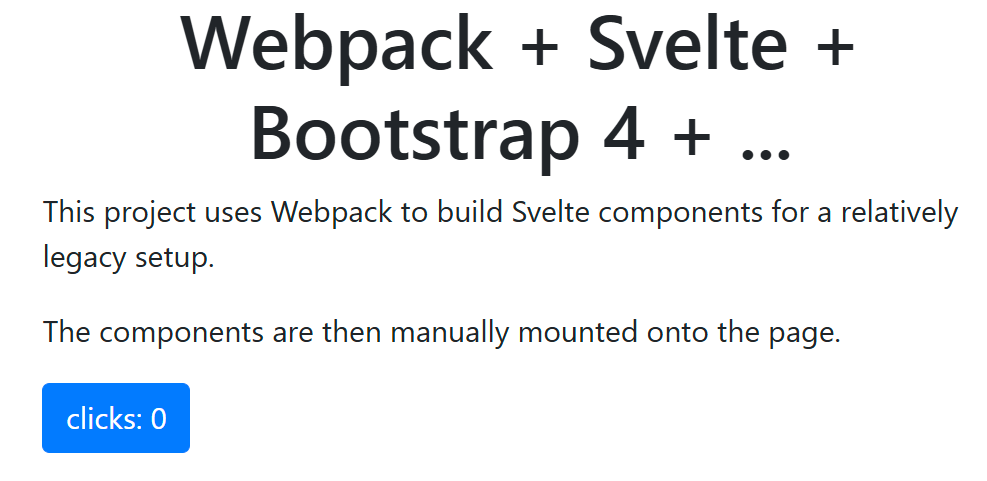

# Svelte Webpack Demo

See it live [here](https://awderh.github.io/svelte-webpack-demo/)

## Add svelte globally

```js
module.exports = {
    ...
    entry: {
        svelte: {
            import: './node_modules/svelte/src/index-client.js',
            library: {
                name: 'svelte',
                type: 'global'
            }
        }
        ...
    },
    ...
};
```

## Setup loader

Add the [svelte-loader]()

```js
module.exports = {
    ...
    module: {
        rules: [
            {
                test: /\.(svelte|svelte\.js)$/,
                use: 'svelte-loader'
            },
            {
                // required to prevent errors from Svelte on Webpack 5+, omit on Webpack 4
                test: /node_modules\/svelte\/.*\.mjs$/,
                resolve: {
                    fullySpecified: false
                }
            }
        ]
    },
    resolve: {
        extensions: ['.json', '.js', '.jsx', '.svelte'],
        conditionNames: ['svelte']
    }
    ...
}
```

## Create entrypoint

```js
module.exports = {
    ...
    entry:{
        Counter: {
            import: './src/Counter.svelte',
            library: {
                name: 'Counter',
                type: 'global'
            }
        }
    }
    ...
}
```

### Change webpack optimizations

Since we have multiple entrypoints that will have overlap (e.g., svelte
internals in this case), we will use a common runtime. The runtime in
Webpack takes care of loading for us.

```js
module.exports = {
    ...
    optimization: {
        runtimeChunk: 'single'
    },
    ...
};
```

If you skip this step, you will get an obscure error along the lines of:
`Uncaught TypeError: Cannot read properties of undefined (reading 'call')`

## Load bundles

```html
<script src="dist/runtime.js"></script>
<script src="dist/svelte.js"></script>
<script src="dist/Counter.js"></script>
```

## Mount component

After the scripts above, add:

```js
<script>
    const container = document.getElementById('counter-container')
    svelte.mount(Counter,
        {
            target: container
        }
    );
</script>
```

## Profit



The steps outlined here are usable for other bundlers too.
The setup difficulty IMO is worth it than the technical debt and maintenance headache of glue logic.
